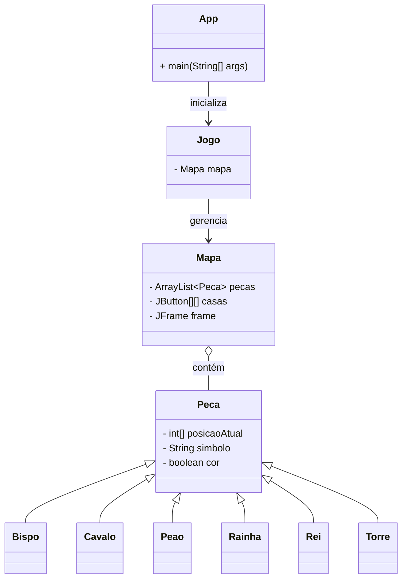

# ♟️ Xadrez Java

Jogo de xadrez desenvolvido em **Java** com interface gráfica **Swing**, utilizando princípios de **orientação a objetos** e herança para modelar as peças do tabuleiro.

---

## 🛠️ Tecnologias

- **Java** — linguagem principal
- **Swing** (`javax.swing`) — interface gráfica
- **AWT** (`java.awt`) — eventos de mouse e layout

---

## 📁 Estrutura do Projeto

```
xadrez-java/
├── src/
│   ├── App.java                  # Ponto de entrada da aplicação
│   └── config/
│       ├── Jogo.java             # Controlador principal do jogo
│       ├── Mapa.java             # Tabuleiro gráfico (8×8) com Swing
│       ├── Peca.java             # Classe base abstrata para todas as peças
│       └── Pecas/
│           ├── Bispo.java        # Bispo (diagonais)
│           ├── Cavalo.java       # Cavalo (movimento em L)
│           ├── Peao.java         # Peão (avanço e captura diagonal)
│           ├── Rainha.java       # Rainha (combina torre + bispo)
│           ├── Rei.java          # Rei (uma casa em qualquer direção)
│           └── Torre.java        # Torre (linhas retas)
└── bin/                          # Classes compiladas (.class)
```

### Descrição das Classes

| Classe | Pacote | Descrição |
|--------|--------|-----------|
| `App` | *(default)* | Classe `main` — inicializa o jogo |
| `Jogo` | `config` | Controlador central que gerencia o tabuleiro |
| `Mapa` | `config` | Renderiza o tabuleiro 8×8 com botões Swing, alternando cores branco/marrom |
| `Peca` | `config` | Classe base com atributos `posicaoAtual`, `simbolo` e `cor` |
| `Bispo` | `config.Pecas` | Herda de `Peca` — move-se nas diagonais |
| `Cavalo` | `config.Pecas` | Herda de `Peca` — move-se em "L" |
| `Peao` | `config.Pecas` | Herda de `Peca` — avança e captura em diagonal |
| `Rainha` | `config.Pecas` | Herda de `Peca` — combina torre e bispo |
| `Rei` | `config.Pecas` | Herda de `Peca` — move uma casa em qualquer direção |
| `Torre` | `config.Pecas` | Herda de `Peca` — move-se em linhas retas |

---

## 📐 Diagrama de Classes



---

## ▶️ Como Executar

### Pré-requisitos

- **JDK 8** ou superior instalado
- Terminal ou prompt de comando

### Compilar

```bash
# A partir da raiz do projeto
javac -d bin src/App.java src/config/Jogo.java src/config/Mapa.java src/config/Peca.java src/config/Pecas/*.java
```

### Executar

```bash
java -cp bin App
```

Uma janela Swing será aberta exibindo o tabuleiro de xadrez 8×8 com casas alternadas em branco e marrom.

---

## ✅ Funcionalidades Atuais

- [x] Interface gráfica com tabuleiro 8×8 usando Swing (`GridLayout`)
- [x] Casas alternadas nas cores branca e marrom
- [x] Hierarquia de classes orientada a objetos para todas as peças do xadrez
- [x] Classe base `Peca` com atributos de posição, símbolo e cor
- [x] Subclasses para cada tipo de peça (Bispo, Cavalo, Peão, Rainha, Rei, Torre)

---

## 👤 Autor

Weverton Vieira Ribeiro

---

## 📝 Licença

Este projeto está sob licença [MIT](https://opensource.org/licenses/MIT).
